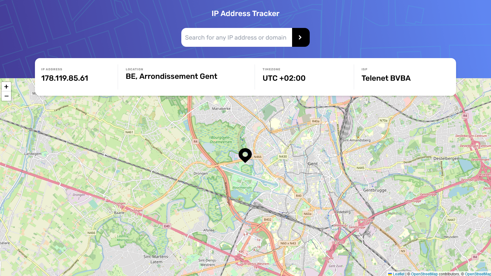

# Frontend Mentor - IP address tracker solution

This is a solution to the [IP address tracker challenge on Frontend Mentor](https://www.frontendmentor.io/challenges/ip-address-tracker-I8-0yYAH0). Frontend Mentor challenges help you improve your coding skills by building realistic projects. 

### Screenshot

### Links

- Challenge URL: [Challenge URL:](https://www.frontendmentor.io/challenges/ip-address-tracker-I8-0yYAH0)
- Live Site URL: [Add live site URL here](https://ip-address-tracker-frontendmentor-one.vercel.app/)

### The challenge

Users should be able to:

- View the optimal layout for each page depending on their device's screen size
- See hover states for all interactive elements on the page
- See their own IP address on the map on the initial page load
- Search for any IP addresses or domains and see the key information and location

## My process
It was my first experience with Tailwind CSS, a fantastic tool. I'm impressed and plan to use it more. I also got to work with various APIs and practice JavaScript. 

In this project, my goal was to make it as user-friendly as possible. I even went the extra mile to create a hypothetical Customer Journey Map to anticipate and accommodate all possible user interactions with the website. I made sure to handle all exceptions gracefully.

For instance, even though the challenge description didn't explicitly mention that users could input either an IP or a domain in the search, it was clear from the information on the placeholder in the screenshot. I wanted to ensure that users would have a smooth and intuitive experience, no matter how they chose to interact with the site.

### Built with

- Semantic HTML5 markup
- Tailwind CSS
- Flexbox
- Mobile-first workflow
- Free IP Geo Location
- Leaflet (map API)

